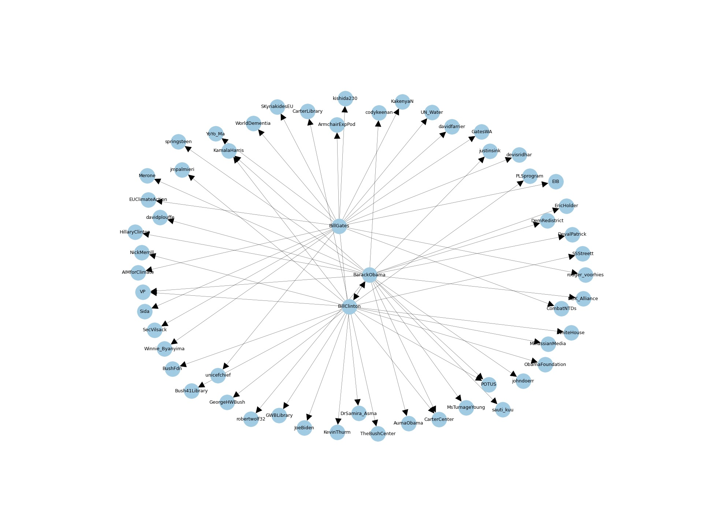

# SocialMediaDataAnalysis

## Introduction

In this project, we will learn how to crawl social media data(Twitter) as well as process and report some analysis on my
extracted data. It includes three steps:

1. Data Collection
2. Data Visualization
3. Network Measures Calculation

## Source Structure

```bash
├── doc
      # crawl data will save into this file
│ ├── all_friends.json  
      # the screen names we want crawl from twitter
│ └── users.txt  
└── main.py
```

## Conclusion
- visualize data about: ['BarackObama', 'BillGates', 'BillClinton']
  

- visualize data about: ['illinoistech', 'ILTechAthletics', 'CoachEdIIT']
  

- visualize all data what we crawled
  


- analysis data with degree rank plot
  
  
- analysis data with degree histogram
  


